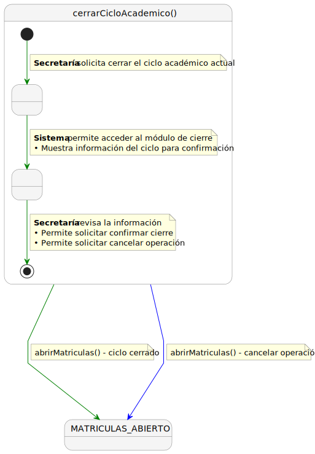
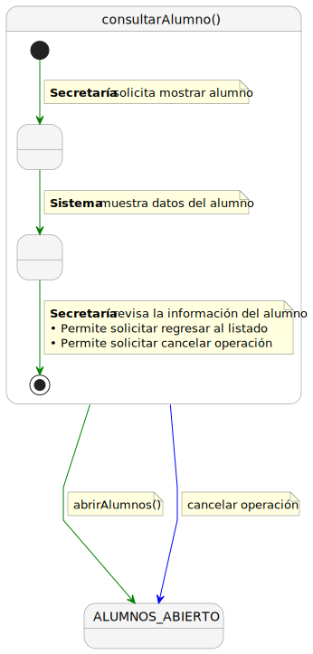
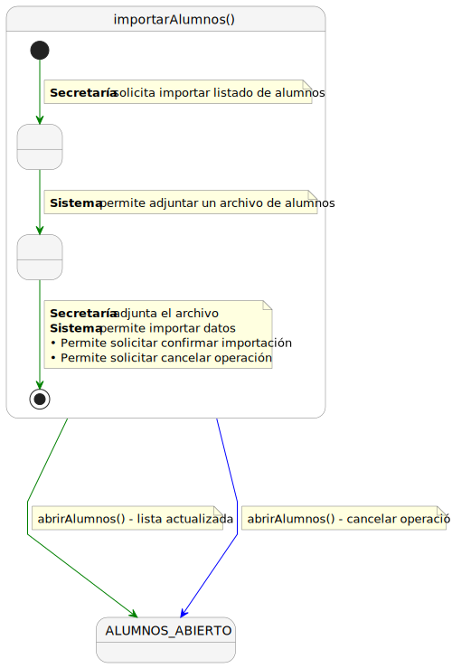

# CGU -- Detalle > Secretaria

> | [Inicio](../../../../README.md) | [Requisitado](../../README.md) | [Detalle](../README.md) | **Secretaria** |
> |---|---|---|---|

| Caso de uso | SVG | PUML |
|-------------|-----|------|
| cerrarCicloAcademico |  | [cerrarCicloAcademico.puml](cerrarCicloAcademico.puml) |
| consultarAlumno |  | [consultarAlumno.puml](consultarAlumno.puml) |
| consultarDetalleMatricula |  | [consultarDetalleMatricula.puml](consultarDetalleMatricula.puml) |
| consultarSolicitudDispensa |  | [consultarSolicitudDispensa.puml](consultarSolicitudDispensa.puml) |
| crearSolicitudDispensa |  | [crearSolicitudDispensa.puml](crearSolicitudDispensa.puml) |
| editarSolicitudDispensa |  | [editarSolicitudDispensa.puml](editarSolicitudDispensa.puml) |
| importarAlumnos |  | [importarAlumnos.puml](importarAlumnos.puml) |
| importarMatriculas |  | [importarMatriculas.puml](importarMatriculas.puml) |
